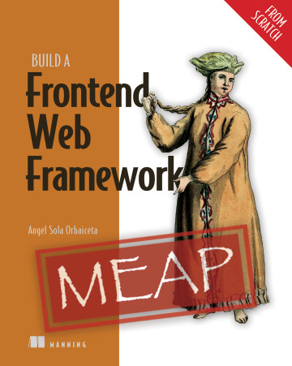

# My Application

This application is built using [fe-fwk](https://github.com/angelsolaorbaiceta/fe-fwk-book), a frontend framework created to teach you how to build your own frontend framework.

Buy your copy of [Build A Web Frontend Framework (fron scratch)](http://mng.bz/aM2o) today and start learning.
You'll create your own framework—completely from scratch—just like the one powering this application.

## Commands

- `npm run dev`: Run the application in development mode, with ultra-fast hot module reloading.
- `npm run build`: Build the application for production. The result will be in the _dist_ folder.
- `npm run preview`: Run the application in production mode, to preview the result of the build.
- `npm test`: Run the tests in watch mode. All _\*.test.js_ files will be considered.
